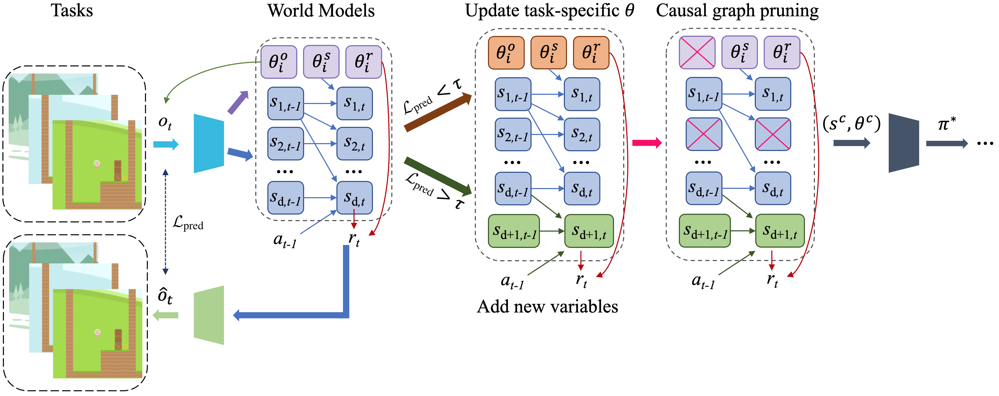

# CSR

This is the official implementation of our ICLR'25 accepted paper:  
["Towards Generalizable Reinforcement Learning via Causality-Guided Self-Adaptive Representations"](https://arxiv.org/pdf/2407.20651).



## Introduction

General intelligence requires quick adaption across tasks. While existing reinforcement learning (RL) methods have made progress in generalization, they typically assume only distribution changes between source and target domains. In this paper, we explore a wider range of scenarios where not only the distribution but also the environment spaces may change. For example, in the CoinRun environment, we train agents from easy levels and generalize them to difficulty levels where there could be new enemies that have never occurred before. To address this challenging setting, we introduce a *causality-guided self-adaptive representation*-based approach, called CSR, that equips the agent to generalize effectively across tasks with evolving dynamics. Specifically, we employ causal representation learning to characterize the latent causal variables within the RL system. Such compact causal representations uncover the structural relationships among variables, enabling the agent to autonomously determine whether changes in the environment stem from distribution shifts or variations in space, and to precisely locate these changes. We then devise a three-step strategy to fine-tune the causal model under different scenarios accordingly. Empirical experiments show that CSR efficiently adapts to the target domains with only a few samples and outperforms state-of-the-art baselines on a wide range of scenarios, including our simulated environments, CartPole, CoinRun and Atari games.

Our key contributions are summarized below:
- We investigate a broader scenario towards generalizable reinforcement learning, where changes occur not only in the distributions but also in the environment spaces of latent variables, and propose a causality-guided self-adaptive representation-based approach to tackle this challenge.
- To characterize both the causal representations and environmental changes, we construct a world model that explicitly uncovers the structural relationships among latent variables in the RL system.
- By leveraging the compact causal representations, we devise a three-step strategy that can identify where the changes of the environment take place and add new causal variables autonomously if necessary. With this self-adaptive strategy, we achieve low-cost policy transfer by updating only a few parameters in the causal model.

## Requirements

The Python environment for experiments in each environment is provided in the corresponding subfolder.  
Please follow the instructions in the `README` file within each subfolder to install the required packages.

For example, for Atari100K:

```bash
cd atari100k  
pip install -r requirements.txt
```

## Policy Adaptation

**CoinRun**

```bash
cd coinrun/world_model
xvfb-run --auto-servernum -s "-screen 0 1400x900x24" python -m world_model.main --configs coinrun --task coinrun --logdir ./world_model/results
```

**Atari100K**

```bash
cd atari100k
python3 main.py --configs atari100k --task atari_pong --logdir ./results/pong
```

**CartPole and Simulated Environments**

```bash
python main.py
```

## Citation

If you find this work useful for your research, please cite our paper:

```bibtex
@InProceedings{yang2024towards,
  title={Towards Generalizable Reinforcement Learning via Causality-Guided Self-Adaptive Representations},
  author={Yang, Yupei and Huang, Biwei and Feng, Fan and Wang, Xinyue and Tu, Shikui and Xu, Lei},
  booktitle={International Conference on Learning Representations (ICLR)},
  year={2024}
}
```

## Acknowledgements

Our code is partly based on the following repositories:

* [coinrun](https://github.com/openai/coinrun)
* [coinrun-dqn-pytorch](https://github.com/unimax/coinrun-dqn-pytorch)
* [dreamerv3](https://github.com/NM512/dreamerv3-torch)
* [dreamerv2](https://github.com/RajGhugare19/dreamerv2)
* [IFactor](https://github.com/AlexLiuyuren/IFactor)

We thank the authors for their excellent work.